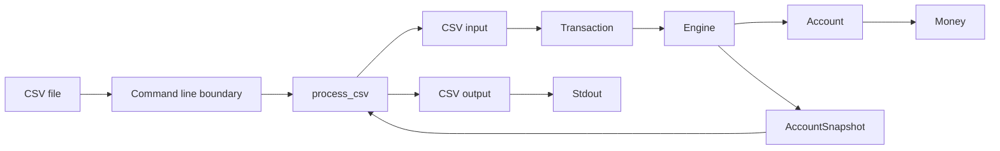
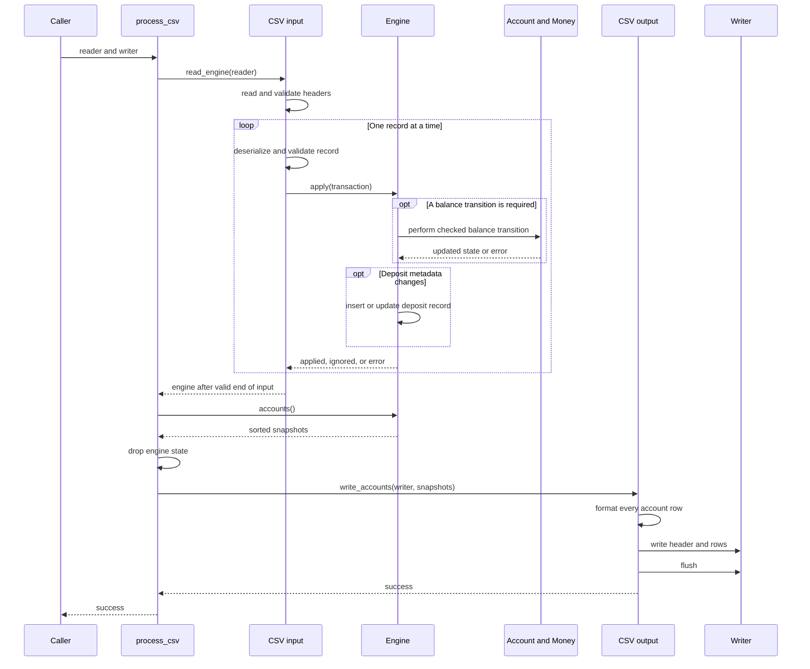
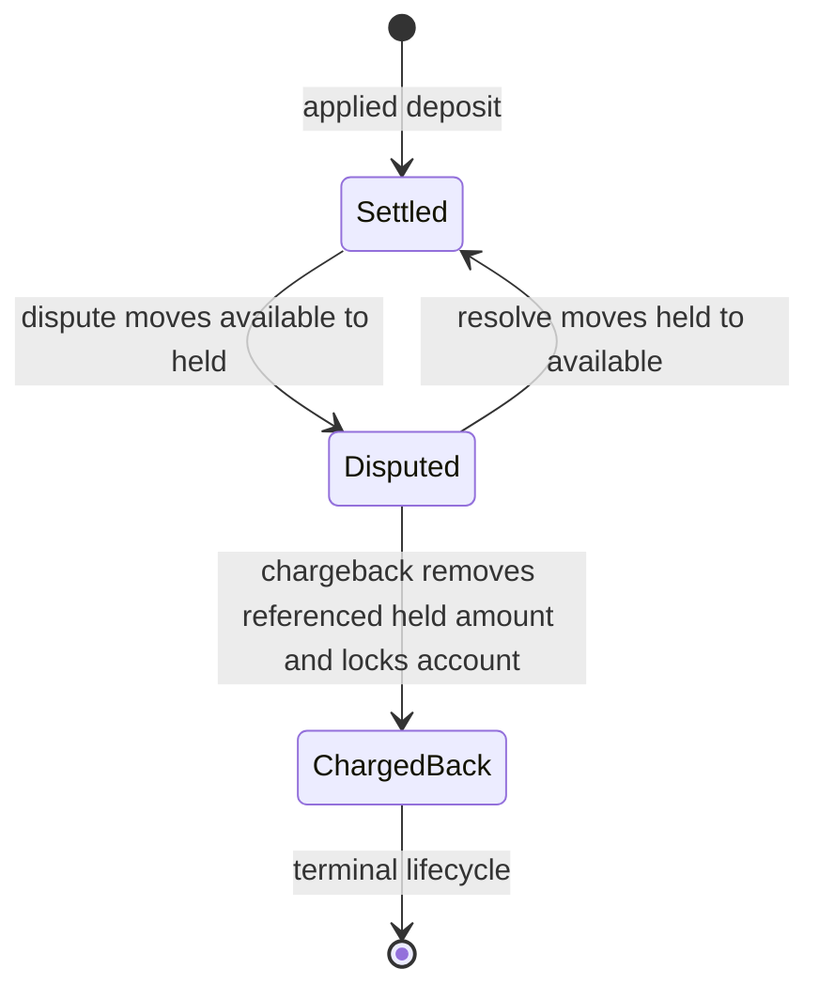

# Architecture Guide

This guide explains the system from the outside in. It starts with the path a
CSV record follows, then describes each component and the contracts between
them. The [README](README.md) remains the place for setup, external behavior,
and settled assumptions. The [review guide](REVIEWING.md) provides the reading
order, test evidence, and verification workflow.

## Mental model

The system is one sequential ledger for one implicit asset, surrounded by input
and output adapters. For one chronological stream:

- `Engine` owns the accounts and the deposit records that later controls may
  reference.
- `Account` owns balance and lock invariants for one client, but not the client
  identifier itself.
- `Money` makes every balance change exact and checked.
- The CSV boundary translates between text and public model types without
  placing parsing concerns in the ledger.
- The command line boundary supplies a file and reserves stdout for the final
  account CSV document.
- The caller chooses the asset represented by an engine because neither the
  public model nor the CSV format carries an asset field.

`Engine::apply` processes one typed transaction at a time. `process_csv` adds
incremental CSV input, waits for a valid end of input, then produces sorted
account output.

## Component and data flow



In prose, the command line boundary opens the input file and gives its reader
and stdout writer to `process_csv`. The input adapter validates each CSV record
and creates a `Transaction`. The engine coordinates the operation, delegates
balance changes to the account, and relies on `Money` for exact arithmetic.
After all input succeeds, `process_csv` asks the engine for sorted
`AccountSnapshot` values and passes them to the output adapter. That adapter
formats the snapshots and writes them to stdout.

The public model types carry data between the adapters and the engine. Error
types cross the same boundaries in the opposite direction, adding context as a
failure moves toward the caller. These are collaborations rather than a strict
module hierarchy.

## Processing one stream



In prose, CSV headers are checked before any transaction. The input adapter
then deserializes, validates, and applies one record before moving to the next.
When a balance change is required, the engine delegates exact validation and
mutation to `Account` and `Money`. After that succeeds, the engine inserts or
updates deposit metadata when the transaction participates in the deposit
lifecycle. An applied or ignored outcome permits processing to continue; an
error stops the operation. After valid input ends, `process_csv` asks the
engine to compute and sort snapshots. It then drops the engine, including
retained deposit metadata. The output adapter formats every snapshot before it
writes the CSV header, rows, and final flush.

This order means an input, engine, snapshot, or formatting failure cannot emit
plausible partial account data. A failure from the writer itself is different:
bytes already accepted by that writer cannot be taken back.

## Deposit lifecycle



In prose, every applied deposit starts in `Settled`. A dispute moves the full
deposit amount from available to held funds without changing the total. A
resolve reverses that move and returns the deposit to `Settled`, so a later
dispute is valid. A chargeback removes the referenced amount from held funds,
reduces the total by that amount, moves the deposit to terminal `ChargedBack`,
and locks the account.

The lifecycle belongs to one deposit, while locking belongs to its account. A
chargeback removes only the referenced deposit amount; it does not clear funds
held for other deposits. The terminal record remains stored until the engine is
dropped. Once the account is locked, later otherwise valid operations for that
account are ignored.

## Component contracts

### Command line boundary

- **Responsibility:** Validate that exactly one input path was supplied, open
  it, connect the library to locked stdout, and report one diagnostic on
  stderr.
- **Owned state:** Only transient arguments, the input path and file, and the
  stdout lock. It owns no ledger state.
- **Input and output:** One filesystem path in; account CSV on stdout or a
  diagnostic on stderr out.
- **Collaborators:** `process_csv` and `ProcessError` from the library.
- **Guarantees:** Stdout contains only account CSV. Usage errors return status
  2; file and processing failures return status 1.
- **Source:** [src/main.rs](src/main.rs).

### CSV boundary

- **Responsibility:** Validate headers and row shapes, parse text without
  rounding, apply rows incrementally, finalize snapshots, and serialize a
  deterministic account document.
- **Owned state:** The reader, one temporary raw record, the engine while input
  is active, final snapshots, and formatted account rows. It never collects
  the complete transaction data set.
- **Input and output:** Any `Read` implementation containing transaction CSV
  and any `Write` implementation receiving account CSV.
- **Collaborators:** Public model types, `Engine`, `ProcessError`, and the `csv`
  crate.
- **Guarantees:** Required headers are accepted in any order, surrounding field
  whitespace is ignored, record order is preserved, control amounts are
  rejected, output clients are sorted, and balances have four decimal places.
- **Source:** [src/csv_io.rs](src/csv_io.rs),
  [src/csv_io/input.rs](src/csv_io/input.rs), and
  [src/csv_io/output.rs](src/csv_io/output.rs).

### Public model

- **Responsibility:** Give callers typed transactions, account snapshots,
  application outcomes, ignore reasons, and identifier aliases.
- **Owned state:** Value data only. These types own no mutable ledger or input
  state.
- **Input and output:** `Transaction` enters the engine; `ApplyOutcome` and
  `AccountSnapshot` leave it.
- **Collaborators:** `Engine`, both CSV adapters, and callers that use the
  library directly.
- **Guarantees:** Client and transaction identifiers use `u16` and `u32`.
  Snapshots produced by `Engine` compute total as `available + held`, and
  ignore reasons remain observable through the direct engine API. The public
  value types perform no validation when callers construct them directly.
- **Source:** [src/model.rs](src/model.rs).

### Engine

- **Responsibility:** Apply transactions in chronological order, coordinate
  accounts, locate deposits for controls, enforce deposit lifecycle rules, and
  produce sorted snapshots.
- **Owned state:** A map from client identifiers to accounts and a map from
  transaction identifiers to applied deposit records. Each deposit record owns
  its client, exact amount, and lifecycle state.
- **Input and output:** One `Transaction` per call; an `ApplyOutcome` or
  `EngineError`; final `AccountSnapshot` values on request.
- **Collaborators:** `Account`, `Money`, and public model and error types.
- **Guarantees:** Only applied deposits become control records. Withdrawals and
  controls are not retained. A control must reference a deposit owned by the
  named client and in the required state. Accounts are returned in ascending
  client order.
- **Source:** [src/engine.rs](src/engine.rs).

### Account

- **Responsibility:** Perform local balance changes and protect the relationship
  between available, held, total, and locked state.
- **Owned state:** Exact available and held balances plus the account lock. The
  engine owns the client identifier that selects this account.
- **Input and output:** Exact amounts and a client identifier for diagnostics;
  success, an insufficient funds result, an error, or a snapshot.
- **Collaborators:** `Money`, `EngineError`, and the coordinating `Engine`.
- **Guarantees:** Held funds never become negative. Total is computed instead
  of stored. Candidate balances are validated before either stored balance is
  replaced. A successful chargeback locks the account.
- **Source:** [src/account.rs](src/account.rs).

### Money

- **Responsibility:** Represent exact monetary values and centralize amount,
  precision, range, addition, and subtraction checks.
- **Owned state:** A signed `i128` count of units worth `0.0001` each.
- **Input and output:** Positive `Decimal` transaction amounts enter; exact
  `Money` values and exact snapshot decimals leave.
- **Collaborators:** `Account`, `Engine`, `EngineError`, and `rust_decimal`.
- **Guarantees:** No binary floating point value or rounding enters balance
  arithmetic. Transaction amounts have at most four decimal places. Signed
  storage permits a dispute to make available funds negative, while every
  conversion remains exact.
- **Source:** [src/money.rs](src/money.rs).

### Error boundaries

- **Responsibility:** Preserve the failure class, relevant client or row
  context, readable diagnostics, and underlying error sources.
- **Owned state:** `EngineError` stores domain details, `ProcessError` stores the
  processing phase and row where available, and the CLI error stores
  invocation and file context.
- **Input and output:** Lower level errors enter wrapping variants; structured
  errors and final diagnostics leave.
- **Collaborators:** Every domain and boundary component.
- **Guarantees:** Domain operations that cannot apply are not confused with
  malformed input or invariant failures. Error source chains remain available
  to programmatic callers.
- **Source:** [src/error.rs](src/error.rs) and
  [src/csv_io/error.rs](src/csv_io/error.rs).

## Failure and ignore boundary

| Class | Processing result | State and output effect | Examples |
| --- | --- | --- | --- |
| CLI invocation or file failure | CLI error | Processing never starts; stdout remains empty | Wrong argument count, input file cannot be opened |
| Invalid input or ledger error | `ProcessError` | Processing stops at the first failure; the local engine is discarded and the writer has not been touched | Invalid headers, malformed row, invalid amount, duplicate retained deposit identifier, arithmetic overflow |
| Valid operation that cannot apply | `ApplyOutcome::Ignored` | Processing continues and the requested balance or lifecycle transition is not applied; a first insufficient withdrawal can still establish an empty account | Insufficient withdrawal, unknown reference, client mismatch, invalid deposit state, locked account |
| Snapshot or formatting invariant failure | `ProcessError` | No account CSV has been written | Invalid internal balance or an inexact output value |
| Writer or flush failure | `ProcessError` | Processing stops; bytes already accepted by the writer may remain | Closed pipe, storage failure |

A first valid withdrawal establishes its client even when it is ignored for
insufficient funds, so that client appears with a zero balance. Unknown or
mismatched controls never establish an account. The CSV boundary deliberately
does not print ignored outcomes; direct `Engine` callers can inspect the exact
reason.

Validation order also affects the reported reason. Deposit and withdrawal
amounts are validated before account locking is checked. A deposit identifier
is checked for a retained duplicate before the lock check. Controls check for
an unknown reference and then a client mismatch before they check the account
lock and required lifecycle state. This is why the lock rule is stated as
ignoring later otherwise valid operations.

## Worked transaction history

This five record input uses one client and unique transaction identifiers:

```csv
type,client,tx,amount
deposit,7,41,8.5000
withdrawal,7,9,3.2500
dispute,7,41,
chargeback,7,41,
deposit,7,42,1.0000
```

The transaction identifier `9` follows `41` because input position, not the
numeric identifier, defines chronology.

| Record | Engine outcome | Deposit `41` state | Available | Held | Total | Locked |
| ---: | --- | --- | ---: | ---: | ---: | --- |
| 1. Deposit `8.5000` | Applied | Settled | `8.5000` | `0.0000` | `8.5000` | false |
| 2. Withdraw `3.2500` | Applied | Settled | `5.2500` | `0.0000` | `5.2500` | false |
| 3. Dispute deposit `41` | Applied | Disputed | `-3.2500` | `8.5000` | `5.2500` | false |
| 4. Charge back deposit `41` | Applied | ChargedBack | `-3.2500` | `0.0000` | `-3.2500` | true |
| 5. Deposit `1.0000` | Ignored: account locked | ChargedBack | `-3.2500` | `0.0000` | `-3.2500` | true |

The withdrawal reduces the account before the dispute arrives. The dispute
still holds the full original deposit, which makes available funds negative
while total remains `5.2500`. The chargeback removes those held funds and locks
the account, leaving a negative total. The final deposit is valid but cannot
change a locked account, so its identifier `42` is not retained.

After valid input ends, the only account row is:

```csv
client,available,held,total,locked
7,-3.2500,0.0000,-3.2500,true
```

## Memory and concurrency

Let `c` be the number of clients, `d` the number of applied deposits, and `r`
the size of the largest CSV record. Processing state is `O(c + d + r)`:
accounts are required for final output, every applied deposit remains stored
for later reference lookup and duplicate protection, and the CSV reader
buffers the current record rather than the full input.

Reading and applying `n` rows takes `O(n)` ledger operations, with expected
constant time map access per row. Finalization creates `O(c)` snapshots and
sorts them in `O(c log c)` time. The engine and all `d` deposit records are
dropped before output row formatting. The output adapter then holds `O(c)`
formatted rows so a formatting failure cannot produce partial account CSV.

Rows within one stream remain sequential because their order defines ledger
chronology. An engine owns both maps, contains no global state or internal
locks, and can be moved to a worker thread. Separately owned engines can
therefore process independent streams concurrently without sharing balances.

`process_csv` uses blocking `Read` and `Write` traits. A server that accepts many
TCP streams owns connection scheduling, framing, timeouts, resource limits,
and any asynchronous runtime. If several connections contribute to one shared
ledger, that server must also define ordering and the transaction identifier
namespace before dispatching rows; this library intentionally does not invent
that contract.

Across concurrent streams, total memory is the sum of each engine's clients,
retained deposits, and largest buffered record. A server must therefore bound
connections, record sizes, and stream lifetimes according to its own capacity.

A caller that handles more than one asset must route each asset to a distinct
engine. Combining assets in one engine would add their amounts without a unit
distinction because the engine intentionally represents one implicit asset.

For a review order, representative test evidence, and verification commands,
continue with the [review guide](REVIEWING.md).
